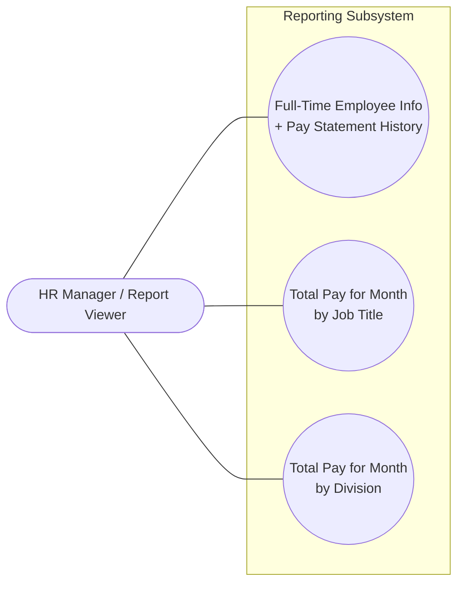
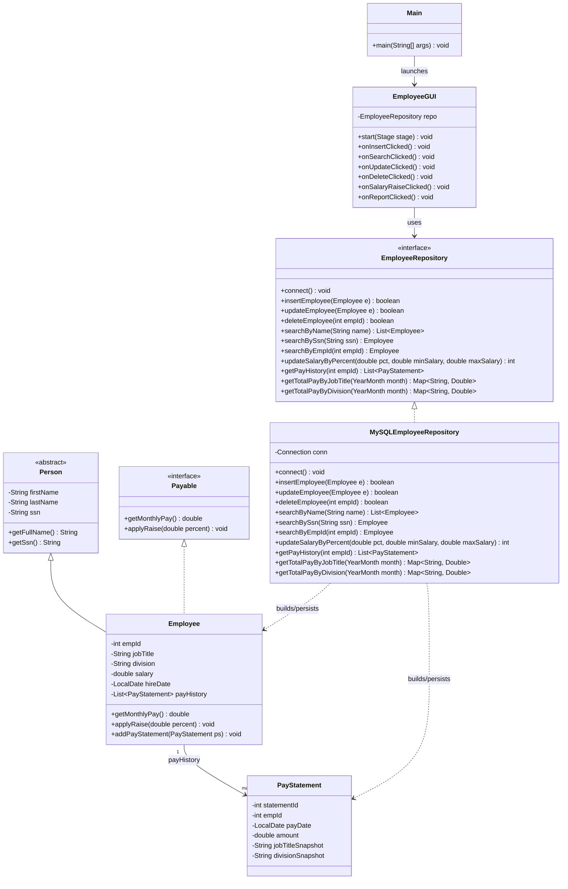
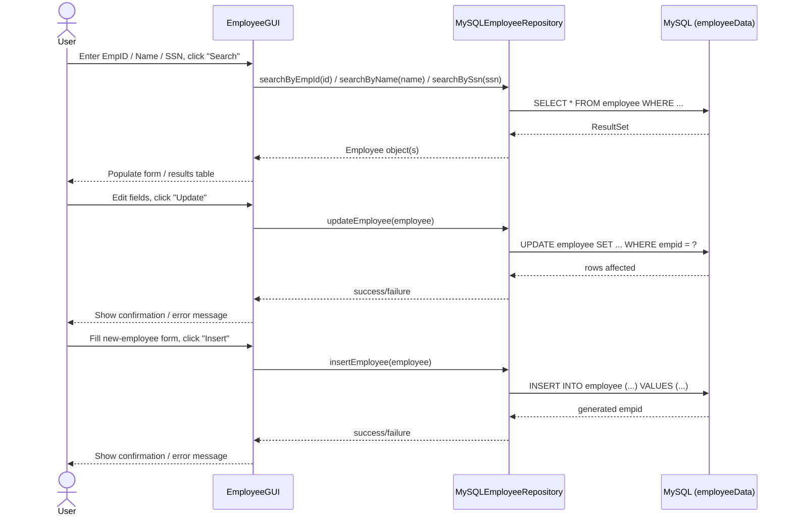
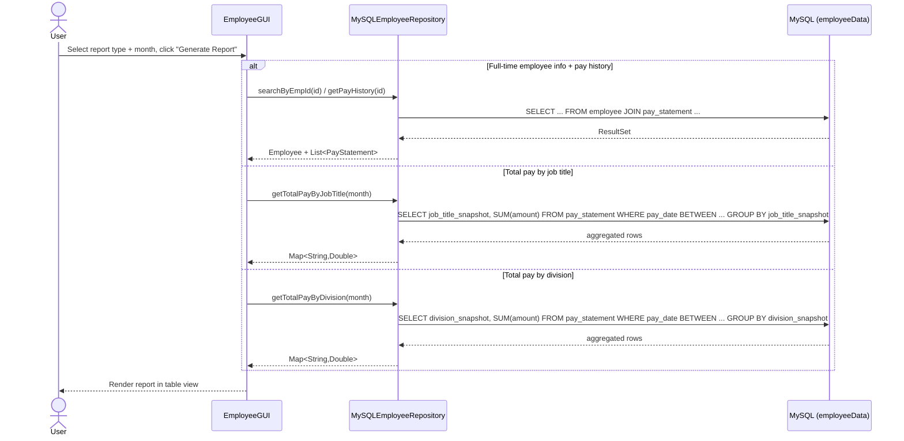

# CompanyZ Employee Management System — Architecture

> For the final PDF report, redraw/export the UML diagrams in the Appendix as polished
> diagrams in a proper UML tool (draw.io, Lucidchart, StarUML, Visual Paradigm, etc.) per the
> assignment rules — no hand drawing. This file is the design record we build those from.

## System Overview

```
┌──────────────────────────────────────────────────────────────────┐
│              CompanyZ Employee Management (JavaFX Desktop App)     │
│                                                                     │
│  ┌───────────────┐   ┌───────────────┐   ┌─────────────────────┐ │
│  │ Employee Form  │   │  Search Panel │   │   Report Screen      │ │
│  │ (Insert/Update │   │  (Name / SSN  │   │  (Pay History, by    │ │
│  │  /Delete)      │   │   / EmpID)    │   │   Title / Division)  │ │
│  └───────┬───────┘   └───────┬───────┘   └──────────┬───────────┘ │
│          │                    │                       │            │
│          └────────────────────┼───────────────────────┘            │
│                                ▼                                    │
│                        EmployeeGUI.java                             │
└────────────────────────────────┬────────────────────────────────────┘
                                  │ calls
                                  ▼
                    ┌───────────────────────────┐
                    │   EmployeeRepository        │
                    │        (interface)          │
                    └─────────────┬─────────────┘
                                  │ implements
                                  ▼
                    ┌───────────────────────────┐
                    │  MySQLEmployeeRepository     │
                    │  (JDBC + SQL queries)        │
                    └─────────────┬─────────────┘
                                  │ JDBC
                                  ▼
                    ┌───────────────────────────┐
                    │   MySQL — employeeData DB    │
                    │  employee / pay_statement     │
                    └───────────────────────────┘
```

No web/HTML layer and no login/authentication — the app talks to MySQL only through JDBC,
directly from the JavaFX GUI's repository calls.

## Data Model

The domain model is shared by every module — the GUI, the repository, and the reporting
queries all read and write the same `Employee` / `PayStatement` shapes.

```java
abstract class Person {
    private String firstName;
    private String lastName;
    private String ssn;              // 9 digits, no dashes
}

interface Payable {
    double getMonthlyPay();
    void applyRaise(double percent);
}

class Employee extends Person implements Payable {
    private int empId;
    private String jobTitle;
    private String division;
    private double salary;
    private LocalDate hireDate;
    private String employmentStatus;         // e.g. "FULL_TIME"
    private List<PayStatement> payHistory;    // dynamic data structure
}

class PayStatement {
    private int statementId;
    private int empId;
    private LocalDate payDate;
    private double amount;
    private String jobTitleSnapshot;   // job title at time of payment
    private String divisionSnapshot;   // division at time of payment
}
```

`Person` is abstract because the system never creates a bare `Person` — every record is an
`Employee`. `Payable` is a separate interface so raise/pay behavior stays testable and
swappable independently of how an `Employee` is built or persisted.

## Module 1 — Data Layer (JDBC / MySQL)

**Responsibilities:** Own the only database connection in the app. Run every insert, update,
delete, search, salary-raise, and report query. The GUI never writes SQL directly.

**Key files:**
- `db/EmployeeRepository.java` — interface contract (`insertEmployee`, `updateEmployee`,
  `deleteEmployee`, `searchByName`/`searchBySsn`/`searchByEmpId`, `updateSalaryByPercent`,
  `getPayHistory`, `getTotalPayByJobTitle`, `getTotalPayByDivision`)
- `db/MySQLEmployeeRepository.java` — JDBC implementation; holds the `Connection` and all SQL

Splitting the interface from the implementation makes the data layer mockable for tests and
keeps `EmployeeGUI` decoupled from SQL entirely.

## Module 2 — GUI (JavaFX)

**Responsibilities:** Forms, buttons, and tables for insert/update/delete/search, the
salary-raise tool, and the report screen. Calls `EmployeeRepository` only.

**Key files:**
- `gui/EmployeeGUI.java` — `start(Stage)`, `onInsertClicked`, `onSearchClicked`,
  `onUpdateClicked`, `onDeleteClicked`, `onSalaryRaiseClicked`, `onReportClicked`
- `Main.java` — entry point, launches `EmployeeGUI`

There is intentionally no `User`/`Auth` class anywhere — the assignment has no login
requirement.

## Module 3 — Salary Raise Tool

**Responsibilities:** Apply a percentage raise to every employee whose salary falls within a
user-given `[minSalary, maxSalary]` range.

**Flow:** `EmployeeGUI.onSalaryRaiseClicked()` → `EmployeeRepository.updateSalaryByPercent(pct,
minSalary, maxSalary)` → `UPDATE employee SET salary = salary * (1 + pct/100) WHERE salary
BETWEEN minSalary AND maxSalary` → returns rows-affected count → GUI shows a confirmation.

## Module 4 — Reporting

**Responsibilities:** Three reports, all backed by the `_snapshot` columns on `pay_statement`
so historical totals stay correct even after an employee changes job title or division.

| Report | Repository method | Query shape |
|---|---|---|
| Full-time employee info + pay statement history | `getPayHistory(empId)` | `employee JOIN pay_statement` |
| Total pay by job title (month) | `getTotalPayByJobTitle(month)` | `GROUP BY job_title_snapshot` |
| Total pay by division (month) | `getTotalPayByDivision(month)` | `GROUP BY division_snapshot` |

## Database Schema

```sql
-- Existing table, extended per requirement #1
ALTER TABLE employee ADD COLUMN ssn CHAR(9) NULL;  -- no dashes, e.g. '123456789'

-- employee (existing + ssn)
-- empid              INT PRIMARY KEY AUTO_INCREMENT
-- first_name         VARCHAR(50)
-- last_name          VARCHAR(50)
-- ssn                CHAR(9)
-- job_title          VARCHAR(50)
-- division           VARCHAR(50)
-- salary             DECIMAL(10,2)
-- hire_date          DATE
-- employment_status  VARCHAR(20)   -- e.g. 'FULL_TIME'

-- pay_statement (pay history, one row per pay period per employee)
-- statement_id       INT PRIMARY KEY AUTO_INCREMENT
-- empid              INT  -- FK -> employee.empid
-- pay_date           DATE
-- amount             DECIMAL(10,2)
-- job_title_snapshot VARCHAR(50)  -- job title at time of payment
-- division_snapshot  VARCHAR(50)  -- division at time of payment
```

## Code / File Structure

```
src/
├── Main.java                    # entry point, launches the JavaFX app
├── model/
│   ├── Person.java               # abstract class
│   ├── Employee.java             # extends Person, implements Payable
│   ├── PayStatement.java
│   └── Payable.java               # interface
├── db/
│   ├── EmployeeRepository.java    # interface (contract)
│   └── MySQLEmployeeRepository.java  # "the database file"
└── gui/
    └── EmployeeGUI.java           # "the GUI file"
```

## Deployment / Run Environment

Desktop assignment — no hosting, no web server. The whole app runs on one machine.

```
Student machine
  └── JavaFX app (Main.java, run from IDE or packaged jar)
          │  JDBC (mysql-connector-j)
          ▼
      MySQL Server — employeeData database
      (local install or shared class MySQL instance)
```

## Open Questions / Decisions Made

- ✅ JDBC straight to MySQL, no web/backend layer — assignment requires a JavaFX desktop app only
- ✅ `EmployeeRepository` interface + `MySQLEmployeeRepository` implementation — decouples the GUI from SQL and satisfies the "database file" + interface requirements
- ✅ `Person` abstract class + `Payable` interface — satisfies the inheritance and interface requirements
- ✅ Pay history as `List<PayStatement>` — the dynamic data structure requirement
- ✅ `_snapshot` columns on `pay_statement` — keeps monthly reports correct even after an employee's role/division changes
- ✅ No login/auth — out of scope per Feature #5, no `User`/`Auth` class anywhere in the design
- ⏳ Salary-raise range boundaries (inclusive vs exclusive at min/max) — confirm against assignment spec before final submission

## Programming Tasks → User Story Mapping

| # | Task | User Story Item | Primary File(s) |
|---|------|------------------|------------------|
| 1 | JDBC connectivity + schema update (`ALTER TABLE ... ADD ssn`) | Feature #1 | `MySQLEmployeeRepository.java` |
| 2 | Search by name / SSN / empid | Feature #2 | `MySQLEmployeeRepository.java`, `EmployeeGUI.java` |
| 3 | Update employee data | Feature #3 | `MySQLEmployeeRepository.java`, `EmployeeGUI.java`, `Employee.java` |
| 4 | Salary raise by % for a salary range | Feature #4 | `MySQLEmployeeRepository.java`, `Payable.java` |
| 5 | Reports (pay history, by job title, by division) + JavaFX report screen | Deliverable #1 reports | `MySQLEmployeeRepository.java`, `EmployeeGUI.java` |

---

## Appendix: UML Diagrams (Mermaid)

Working versions of the required Use Case, Class, and Sequence diagrams. Mermaid renders
directly on GitHub, VS Code, and most Markdown viewers.

### Use Case — Overall System


### Use Case — Reporting



### Class Diagram



### Sequence — Overall System (Search / Insert / Update)



### Sequence — Reporting


