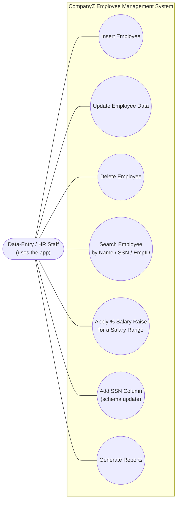
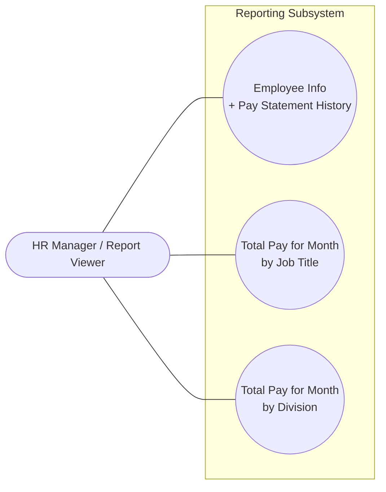
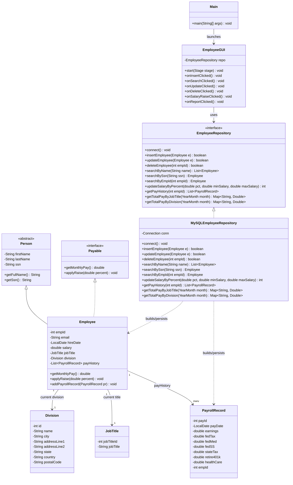
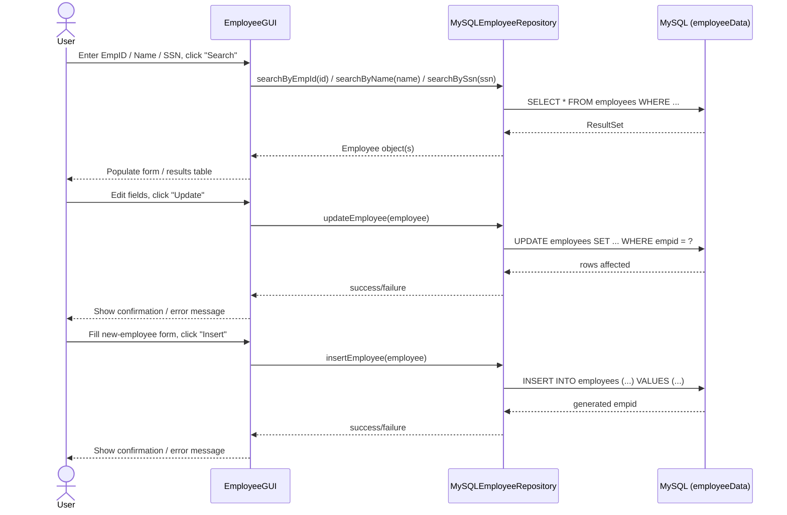
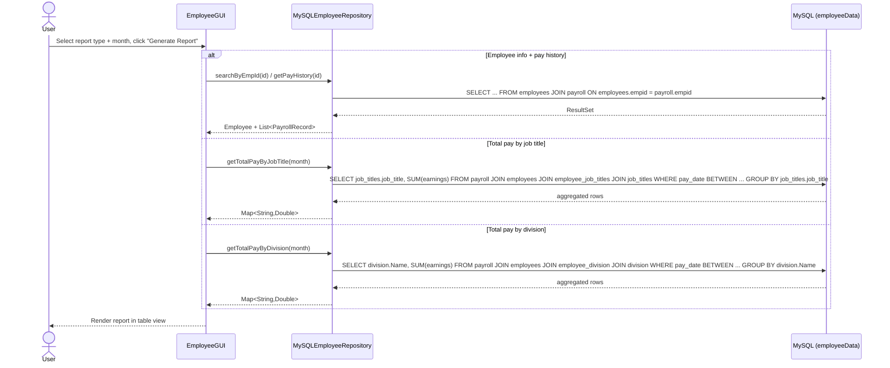

# CompanyZ Employee Management System — Architecture

> For the final PDF report, redraw/export the UML diagrams in the Appendix as polished
> diagrams in a proper UML tool (draw.io, Lucidchart, StarUML, Visual Paradigm, etc.) per the
> assignment rules — no hand drawing. This file is the design record we build those from.
>
> **Schema source of truth:** `ER_diagram_employeeData_03062024.pdf` (the professor's existing
> `employeeData` database). Everything below is built to match that real schema, not an
> invented one — see [Database Schema](#database-schema).

## System Overview

```
┌──────────────────────────────────────────────────────────────────┐
│              CompanyZ Employee Management (JavaFX Desktop App)     │
│                                                                     │
│  ┌───────────────┐   ┌───────────────┐   ┌─────────────────────┐ │
│  │ Employee Form  │   │  Search Panel │   │   Report Screen      │ │
│  │ (Insert/Update │   │  (Name / SSN  │   │  (Pay History, by    │ │
│  │  /Delete)      │   │   / EmpID)    │   │   Title / Division)  │ │
│  └───────┬───────┘   └───────┬───────┘   └──────────┬───────────┘ │
│          │                    │                       │            │
│          └────────────────────┼───────────────────────┘            │
│                                ▼                                    │
│                        EmployeeGUI.java                             │
└────────────────────────────────┬────────────────────────────────────┘
                                  │ calls
                                  ▼
                    ┌───────────────────────────┐
                    │   EmployeeRepository        │
                    │        (interface)          │
                    └─────────────┬─────────────┘
                                  │ implements
                                  ▼
                    ┌───────────────────────────┐
                    │  MySQLEmployeeRepository     │
                    │  (JDBC + SQL queries)        │
                    └─────────────┬─────────────┘
                                  │ JDBC
                                  ▼
                    ┌────────────────────────────────────┐
                    │      MySQL — employeeData DB          │
                    │  employees / job_titles / division /  │
                    │  employee_job_titles / employee_      │
                    │  division / payroll                   │
                    └────────────────────────────────────┘
```

No web/HTML layer and no login/authentication — the app talks to MySQL only through JDBC,
directly from the JavaFX GUI's repository calls.

## Data Model

The domain model mirrors the real `employeeData` tables. `JobTitle` and `Division` are
separate lookup objects (not plain strings on `Employee`) because the schema joins to them
through `employee_job_titles` / `employee_division`.

```java
abstract class Person {
    private String firstName;   // employees.Fname
    private String lastName;    // employees.Lname
    private String ssn;         // employees.ssn — new column, 9 digits, no dashes
}

interface Payable {
    double getMonthlyPay();
    void applyRaise(double percent);
}

class Employee extends Person implements Payable {
    private int empId;                      // employees.empid
    private String email;
    private LocalDate hireDate;
    private double salary;
    private JobTitle jobTitle;              // via employee_job_titles -> job_titles
    private Division division;              // via employee_division -> division
    private List<PayrollRecord> payHistory; // dynamic data structure, from payroll
}

class JobTitle {
    private int jobTitleId;
    private String jobTitle;
}

class Division {
    private int id;
    private String name;
    private String city;
    private String addressLine1;
    private String addressLine2;
    private String state;
    private String country;
    private String postalCode;
}

class PayrollRecord {
    private int payId;
    private LocalDate payDate;
    private double earnings;
    private double fedTax;
    private double fedMed;
    private double fedSS;
    private double stateTax;
    private double retire401k;
    private double healthCare;
    private int empId;
}
```

`Person` is abstract because the system never creates a bare `Person` — every record is an
`Employee`. `Payable` is a separate interface so raise/pay behavior stays testable and
swappable independently of how an `Employee` is built or persisted.

**Design decision — junction tables treated as single-current-association:** `employee_job_titles`
and `employee_division` are technically many-to-many in the schema, but neither table has a
date/effective-range column, so there's no way to tell "current" from "past" rows. For this
project's scope (fewer than 20 employees, no history requirement beyond pay statements), the
repository treats each employee as having exactly **one** active job title and **one** active
division at a time: updating either means delete-then-insert the junction row, not append.

## Module 1 — Data Layer (JDBC / MySQL)

**Responsibilities:** Own the only database connection in the app. Run every insert, update,
delete, search, salary-raise, and report query across `employees`, `job_titles`, `division`,
the two junction tables, and `payroll`. The GUI never writes SQL directly.

**Key files:**
- `db/EmployeeRepository.java` — interface contract (`insertEmployee`, `updateEmployee`,
  `deleteEmployee`, `searchByName`/`searchBySsn`/`searchByEmpId`, `updateSalaryByPercent`,
  `getPayHistory`, `getTotalPayByJobTitle`, `getTotalPayByDivision`)
- `db/MySQLEmployeeRepository.java` — JDBC implementation; holds the `Connection` and all SQL,
  including the joins through `employee_job_titles`/`employee_division` needed to resolve an
  employee's current `JobTitle`/`Division`

Splitting the interface from the implementation makes the data layer mockable for tests and
keeps `EmployeeGUI` decoupled from SQL entirely.

## Module 2 — GUI (JavaFX)

**Responsibilities:** Forms, buttons, and tables for insert/update/delete/search, the
salary-raise tool, and the report screen. Calls `EmployeeRepository` only.

**Key files:**
- `gui/EmployeeGUI.java` — `start(Stage)`, `onInsertClicked`, `onSearchClicked`,
  `onUpdateClicked`, `onDeleteClicked`, `onSalaryRaiseClicked`, `onReportClicked`
- `Main.java` — entry point, launches `EmployeeGUI`

There is intentionally no `User`/`Auth` class anywhere — the assignment has no login
requirement.

## Module 3 — Salary Raise Tool

**Responsibilities:** Apply a percentage raise to every employee whose salary falls within a
user-given `[minSalary, maxSalary)` range (e.g. 3.2% for salary ≥ $58K and < $105K).

**Flow:** `EmployeeGUI.onSalaryRaiseClicked()` → `EmployeeRepository.updateSalaryByPercent(pct,
minSalary, maxSalary)` → `UPDATE employees SET Salary = Salary * (1 + pct/100) WHERE Salary >=
minSalary AND Salary < maxSalary` → returns rows-affected count → GUI shows a confirmation.

## Module 4 — Reporting

**Responsibilities:** Three reports. Since `payroll` has **no snapshot columns**, the job-title
and division reports group by an employee's **current** title/division (via the junction
tables), not the title/division they held at the time of that payment. This is a known
limitation of the real schema — flag it explicitly in the SWDD report rather than inventing
snapshot columns that don't exist.

The scenario states the company has "less than twenty full-time employees" with no
part-time/full-time flag in `employees`, so the "full-time employee" report needs no status
filter — it's just every employee.

| Report | Repository method | Query shape |
|---|---|---|
| Employee info + pay statement history | `getPayHistory(empId)` | `employees JOIN payroll ON employees.empid = payroll.empid` |
| Total pay by job title (month) | `getTotalPayByJobTitle(month)` | `payroll JOIN employees JOIN employee_job_titles JOIN job_titles`, `SUM(earnings) GROUP BY job_titles.job_title` |
| Total pay by division (month) | `getTotalPayByDivision(month)` | `payroll JOIN employees JOIN employee_division JOIN division`, `SUM(earnings) GROUP BY division.Name` |

"Total pay" = `SUM(payroll.earnings)` (gross pay) for the month. Confirm with the professor
whether net pay (earnings minus taxes/deductions) is expected instead before finalizing.

## Database Schema

Matches `ER_diagram_employeeData_03062024.pdf` exactly, plus the one new column required by
the assignment.

```sql
-- Existing table, extended per requirement #1
ALTER TABLE employees ADD COLUMN ssn CHAR(9) NULL;  -- no dashes, e.g. '123456789'

-- employees (existing + ssn)
-- empid      INT PRIMARY KEY AUTO_INCREMENT
-- Fname      VARCHAR(50)
-- Lname      VARCHAR(50)
-- email      VARCHAR(100)
-- ssn        CHAR(9)          -- new column
-- HireDate   DATE
-- Salary     DECIMAL(10,2)

-- job_titles (lookup)
-- job_title_id  INT PRIMARY KEY AUTO_INCREMENT
-- job_title     VARCHAR(50)

-- employee_job_titles (junction — treated as 1 active row per empid, see Data Model)
-- empid         INT  -- FK -> employees.empid
-- job_title_id  INT  -- FK -> job_titles.job_title_id

-- division (lookup)
-- ID            INT PRIMARY KEY AUTO_INCREMENT
-- Name          VARCHAR(100)
-- city          VARCHAR(50)
-- addressLine1  VARCHAR(100)
-- addressLine2  VARCHAR(100)
-- state         VARCHAR(50)
-- country       VARCHAR(50)
-- postalCode    VARCHAR(20)

-- employee_division (junction — treated as 1 active row per empid, see Data Model)
-- empid   INT  -- FK -> employees.empid
-- div_ID  INT  -- FK -> division.ID

-- payroll (pay history, one row per pay period per employee — no snapshot columns)
-- payID        INT PRIMARY KEY AUTO_INCREMENT
-- pay_date     DATE
-- earnings     DECIMAL(10,2)
-- fed_tax      DECIMAL(10,2)
-- fed_med      DECIMAL(10,2)
-- fed_SS       DECIMAL(10,2)
-- state_tax    DECIMAL(10,2)
-- retire_401k  DECIMAL(10,2)
-- health_care  DECIMAL(10,2)
-- empid        INT  -- FK -> employees.empid
```

A DBeaver-exported schema diagram (original + the `ssn` column) is an **optional** deliverable
per the assignment — nice to include in the SWDD report but not required.

## Code / File Structure

```
src/
├── Main.java                    # entry point, launches the JavaFX app
├── model/
│   ├── Person.java               # abstract class
│   ├── Employee.java             # extends Person, implements Payable
│   ├── JobTitle.java
│   ├── Division.java
│   ├── PayrollRecord.java
│   └── Payable.java               # interface
├── db/
│   ├── EmployeeRepository.java    # interface (contract)
│   └── MySQLEmployeeRepository.java  # "the database file"
└── gui/
    └── EmployeeGUI.java           # "the GUI file"
```

## Deployment / Run Environment

Desktop assignment — no hosting, no web server. The whole app runs on one machine.

```
Student machine
  └── JavaFX app (Main.java, run from IDE or packaged jar)
          │  JDBC (mysql-connector-j)
          ▼
      MySQL Server — employeeData database
      (class-provided server, or a shared instance the team hosts)
```

## Open Questions / Decisions Made

- ✅ JDBC straight to MySQL, no web/backend layer — assignment requires a JavaFX desktop app only
- ✅ `EmployeeRepository` interface + `MySQLEmployeeRepository` implementation — decouples the GUI from SQL and satisfies the "database file" + interface requirements
- ✅ `Person` abstract class + `Payable` interface — satisfies the inheritance and interface requirements
- ✅ Pay history as `List<PayrollRecord>` — the dynamic data structure requirement
- ✅ Schema realigned to the professor's actual `employeeData` ER diagram — `job_titles` and
  `division` are lookup tables joined via `employee_job_titles`/`employee_division`, not plain
  columns on `employees`; `payroll` uses `earnings`/tax/deduction columns, not a single `amount`
- ✅ Junction tables treated as one active row per employee (no date-range column exists to
  support true history) — update = delete old row + insert new row
- ✅ Reports group by an employee's **current** job title/division, since `payroll` has no
  snapshot columns — documented as a known limitation, not silently assumed
- ✅ No login/auth — out of scope per Feature #5, no `User`/`Auth` class anywhere in the design
- ⏳ Salary-raise range boundaries (inclusive vs exclusive at min/max) — confirm against assignment spec before final submission
- ⏳ "Total pay" in reports = gross `earnings` vs net after deductions — confirm with professor

## Programming Tasks → User Story Mapping

| # | Task | User Story Item | Primary File(s) |
|---|------|------------------|------------------|
| 1 | JDBC connectivity + schema update (`ALTER TABLE employees ADD ssn`) | Feature #1 | `MySQLEmployeeRepository.java` |
| 2 | Search by name / SSN / empid | Feature #2 | `MySQLEmployeeRepository.java`, `EmployeeGUI.java` |
| 3 | Update employee data | Feature #3 | `MySQLEmployeeRepository.java`, `EmployeeGUI.java`, `Employee.java` |
| 4 | Salary raise by % for a salary range | Feature #4 | `MySQLEmployeeRepository.java`, `Payable.java` |
| 5 | Reports (pay history, by job title, by division) + JavaFX report screen | Deliverable #1 reports | `MySQLEmployeeRepository.java`, `EmployeeGUI.java` |

---

## Appendix: UML Diagrams (Mermaid)

Working versions of the required Use Case, Class, and Sequence diagrams. Mermaid renders
directly on GitHub, VS Code, and most Markdown viewers.

### Use Case — Overall System



### Use Case — Reporting



### Class Diagram



### Sequence — Overall System (Search / Insert / Update)



### Sequence — Reporting


